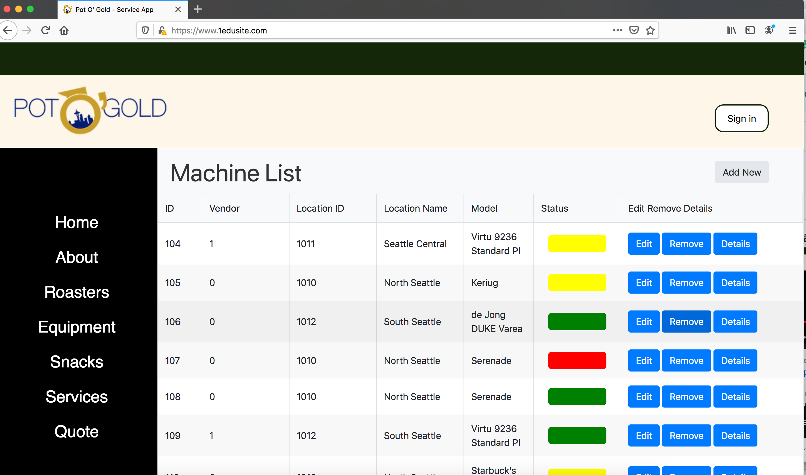
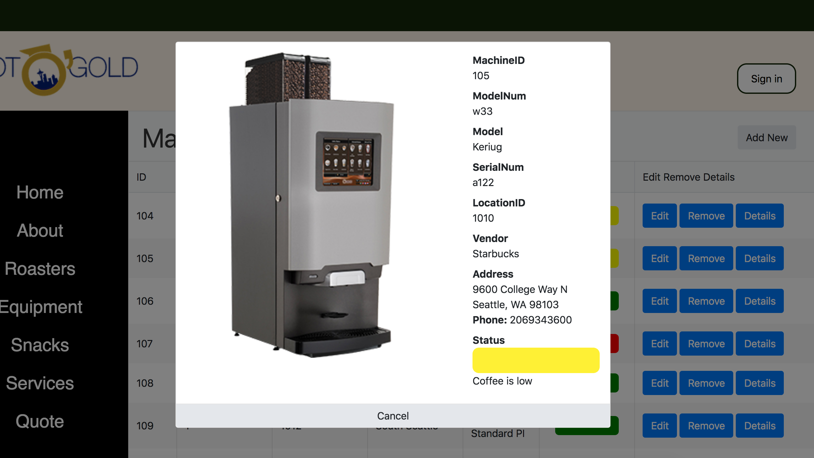
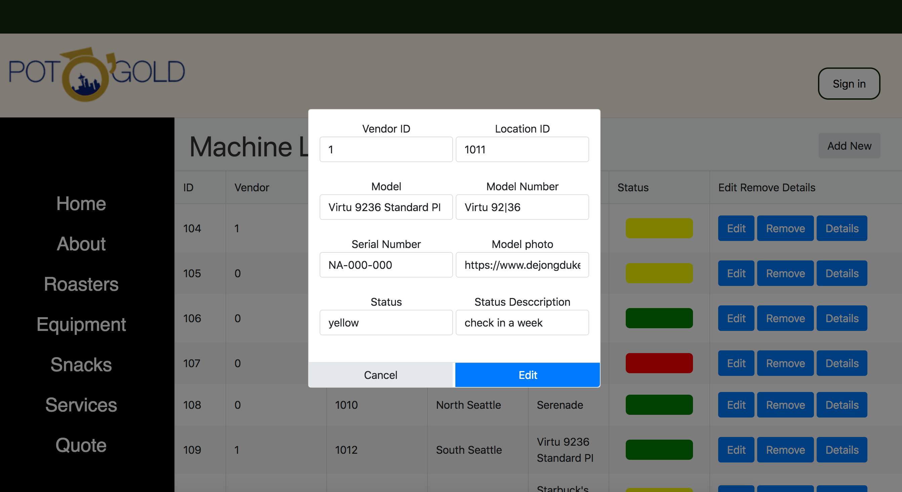
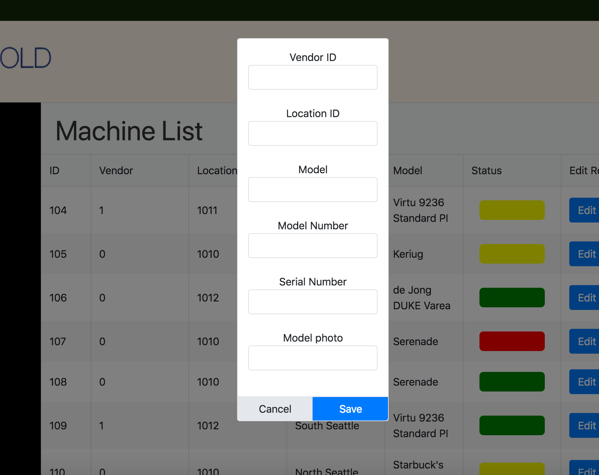
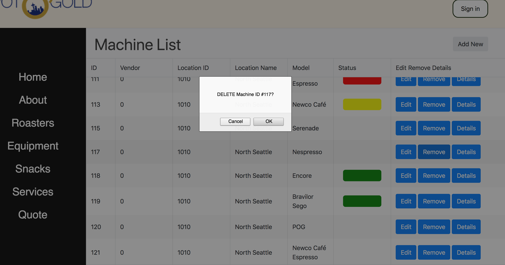
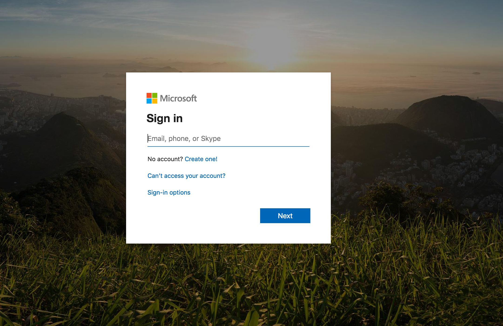

# ad440-winter2020-tuesday-repo

Welcome to the North Seattle AD440 "Coffee" Cloud Computing Practicum! 

## Getting Started
This practicum is geared Azure, and uses React, Javascript, and Python. This app does not use a traditional stack, like LAMP, or SEAN. Rather it breaks its tasks down into descrete files of code that execute using Azure services like Functions 
#### Table with coffee machines displaying details and working status of every machine

#### Machine details pop up

#### Machine edit form pop up

#### Adding new machine form

#### Delete machine

#### Login page for coffee service personel

### Installing
While the app is deployed to the cloud, there are several local tools one should have local on their computer if they want to join in the development of this app. You may not need all the tools listed to work on this app.

### Node.js
https://nodejs.org/en/download/

### React
https://reactjs.org/

### Python
https://www.python.org/

